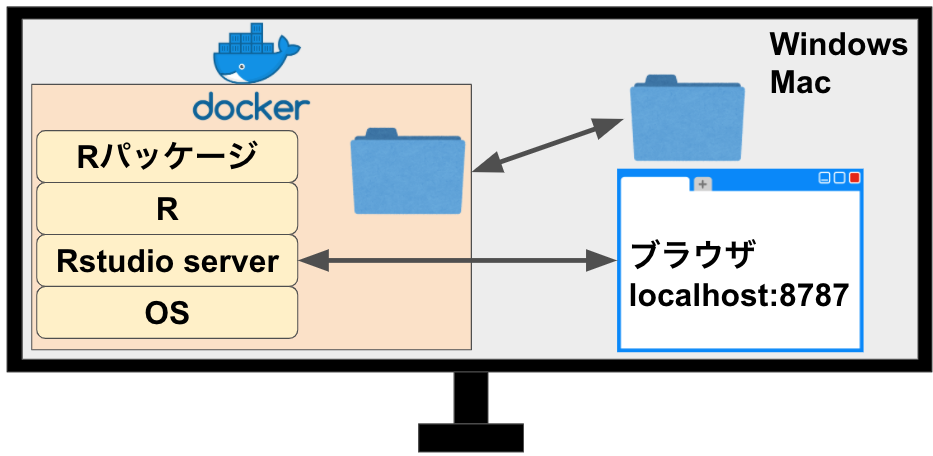

```{r setup, include=FALSE}
options(htmltools.dir.version = FALSE)
```

```{r xaringan-themer, include=FALSE, warning=FALSE}
library(xaringanthemer)
extra_css <- list(
  ".red"   = list(color = "red"),
  ".green"   = list(color = "green"),
  ".small" = list("font-size" = "60%"),
  ".med" = list("font-size" = "80%"),
  ".large" = list("font-size" = "140%"),
  ".full-width" = list(
    display = "flex",
    width   = "100%",
    flex    = "1 1 auto"
  )
)
style_mono_accent(base_color = "#006400",
  text_font_size = "30px",
  code_font_size = "20px",
  padding = "1em 1em 1em 1em",#margin
  header_h1_font_size = "45px",
  header_h2_font_size = "40px",
  header_h3_font_size = "35px",
  header_color = "#006400",
  header_font_google = google_font("Song Myung"),
  text_font_google   = google_font("Song Myung", "400", "400i"),
  code_font_google   = google_font("Song Myung"),
  link_color = "#A52A2A",
  extra_css = extra_css
)
```

class: center, middle
# 1.再現可能な解析や論文執筆とは？

---
# 心理学の再現性の危機
- 心理学研究100本のうち再現されたのは39本(Open Science Collaboration, 2016, Science)
- 引用数が多く効果があるとされた臨床医学研究45本のうち再現されたのは20本(Ioannidis, 2005, JAMA)
- 1576名の調査から，70%が他の研究者の研究を再現できず，50%が自分の研究の再現もできなかった(Baker, 2016, Nature)

→心理学の研究の再現性は低い。心理学の知見を信じていいの？
---

# ３つの再現性(Goodman et al., 2016)

- .large[方法]の再現可能性: 論文と.red[同じデータ]に.red[同じ方法]を用いて，.red[同じ結果]が得られること

- .large[結果]の再現可能性: .red[新規のデータ]に.red[同じ方法]を用いて，.red[同じ結果]が得られること

- .large[推論]の再現可能性: .red[同じ結果]から質的に.red[同じ結論]が得られること

→本TWSの目的は，方法の再現可能性を高めること！

---

# なぜ？方法の再現可能性低い？

- 「同じデータ + 同じ方法 = 同じ結果」って，当たり前じゃないの？

→同じデータが難しい・・・

- 2000-2014年の生物医学論文のうち生データが直接利用可能なのは441本中0本だった(Iqbal et al., 2016)
- 2015-2017年に出版された生物医学論文のうちデータの入手可能性を記載していたのは，たった18.3%(Wallach et al., 2018)

→データが無ければそもそも不可能・・・
---
# なぜ？方法の再現可能性低い？

- 「同じデータ + 同じ方法 = 同じ結果」って，当たり前じゃないの？

→同じ方法が難しい・・・

- Science誌掲載論文では，データとコードの共有していた研究が44%，そのうち再現できたのは26%(Stodden et al, 2018)
- Cognition誌掲載論文では，35本中再現できたのは22本(その内11本は再現するのに著者の協力が必要, Hardwicke et al., 2018)。

→データもコードもあっても再現できない・・・

---
# 方法の再現可能性を高める方法

1. 共有を前提にデータとコードを用意する
1. ファイルを組織化する(Research Compendium)
1. データから論文出版までを一気につなぐ
1. 解析環境をまるごと共有する

---
# 共有を前提にデータとコードを用意する
- 第３者が利用できるように，機械が読みやすく人も理解しやすい形式でデータを配布する(tidy data)
- ヒトから収集したデータを共有・公開する場合は，データ共有に対する同意も必要になる(倫理審査から準備する)。
- データから個人が特定できないように工夫する(個人識別情報を含んでなくても特定できることがある)
- 第３者が利用できるように，解析コードは，その分野で馴染みのある書き方にする(Rの場合は，The tidyverse style guide https://style.tidyverse.org/)

---
# ファイルを組織化する.med[(Research Compendium)]

- 第３者がわかるようにファイルとフォルダを組織化する。Rのパッケージ開発を意識した整理法が注目されつつある(Research Compendium)。


---
# データから論文出版までを一気につなぐ
- 生データから論文までが追跡できるように用意する


---

# 解析環境をまるごと共有する
- パッケージのバージョンが違ったりすると，結果が再現できないことがある。
- 解析環境(OSやソフト)が違うとそもそも実行ができないor結果が再現できないことがある。

→ コードだけでなく，解析環境やバージョン情報も公開する。

→ Dockerを使ってOSやソフトを含んだコンテナを共有する。
---
# 方法の再現可能性を高めるツール

1.共有を前提にデータとコードを用意する = The tidyverse style guide

2.ファイルを組織化する(Research Compendium) = jpaRmd, rrtools

3.データから論文出版までを一気につなぐ = Rstudio, R Markdown, github, osfr

4.解析環境をまるごと共有する = Docker, renv
---

class: center, middle
# 2.RStudioとRmarkdown環境を整える

---
# 解析環境を整える

- 統計解析環境の構築では，RとRStudioがおすすめ（フリー，実は難しくない，高機能，便利な変態的パッケージがある）。
- Rは[The R Project for Statistical Computing](https://www.r-project.org/)，Rstudioは[RStudio社のHP](https://rstudio.com/products/rstudio/)からデスクトップ版をダウンロード＆インストールできる。

デメリット：(1)Rstanなどインストールでトラブりがちなパッケージの用意が面倒，(2)複数のパソコンで完全に同じ環境を整えるのは大変，(3)純粋にめんどくさい

---
# Dockerとは？
- OSに依存せずに，Linuxベースのアプリケーションをコンテナ化する技術。Dockerではコンテナのイメージをつくるが，これを共有すれば，再現可能な環境を共有できる。


---

# どうやってDockerイメージをつくる？
- Dockerfileを自分で定義すれば，オリジナルのイメージが作れる。
- ただ，自作にはLinuxの知識が要求されるので，なかなかハードルが高い（ググるだけではあるけど...）

→　Docker Hub(https://registry.hub.docker.com/u/rocker )で公開されているビルド済みのイメージを使って，お手軽に環境構築しましょう！

---

### The Rocker Project(https://hub.docker.com/u/rocker )

- r-ver : 生RのDocker
- rstudio	: rstudioを追加したもの
- tidyverse	: tidyverseとdevtoolsを追加したもの		
- verse	: TeXと出版関連パッケージを追加したもの
- geospatial : verseにgeospatialを追加		
- shiny	: r-verにshiny serverを追加
- shiny-verse	: shinyにtidyverseを追加
- binder : geospatialをmybinder.orgで動かす用	
- ml : tidyverseにpythonとTensorflowを追加		
- ml-verse : verseにpythonとTensorflowを追加

---

# Rockerの仕組み

パソコン内にコンテナを用意して，rstudioサーバーを動かす。ブラウザからRsutidoサーバーにアクセス。フォルダをマウント



---

# 論文執筆に便利なDocker
- ykunisato/paper-rは，RstudioでR Markdownを用いて論文執筆を行う際に便利なパッケージやアドインを含めたDockerファイルのリポジトリ (https://hub.docker.com/r/ykunisato/paper-r )

- ykunisato/paper-rは，rocker/verseをベースにして，各種Rmarkdownで使うパッケージやアドインはもちろん心理学で使いそうなRパッケージは大体入っている（Rstanも最初から入っている）。

---

# Rockerの使い方

- Dockerのインストール（事前準備動画を参照ください）
- ターミナル(Mac)・コマンドプロンプト(Win)で以下を実行

< Windows >

docker run -e PASSWORD=paper -p 8787:8787 -v "%cd%":/home/rstudio -d --name paper ykunisato/paper-r

< Mac >

docker run -e PASSWORD=paper -e DISABLE_AUTH=true -p 8787:8787 -v $PWD:/home/rstudio -d --name paper ykunisato/paper-r

---

# Rを用いた再現可能な解析について

- 解析環境は整ったので，以降ではRMarkdownを使って英語論文と日本語論文を書いてみましょう！
- Githubを活用するとバージョン管理も可能になります( https://kunisatolab.github.io/main/how-to-github.html )


---
# 引用文献
.small[
- Baker, M. (2016). 1,500 scientists lift the lid on reproducibility. Nature, 533(7604), 452–454.
- Goodman, S. N., Fanelli, D., & Ioannidis, J. P. A. (2016). What does research reproducibility mean? Science Translational Medicine, 8(341), 341ps12.
- Hardwicke, T. E., Mathur, M. B., MacDonald, K., Nilsonne, G., Banks, G. C., Kidwell, M. C., Hofelich Mohr, A., Clayton, E., Yoon, E. J., Henry Tessler, M., Lenne, R. L., Altman, S., Long, B., & Frank, M. C. (2018). Data availability, reusability, and analytic reproducibility: evaluating the impact of a mandatory open data policy at the journal Cognition. Royal Society Open Science, 5(8), 180448.
- Iqbal, S. A., Wallach, J. D., Khoury, M. J., Schully, S. D., & Ioannidis, J. P. A. (2016). Reproducible Research Practices and Transparency across the Biomedical Literature. PLoS Biology, 14(1), e1002333.
- Ioannidis, J. P. A. (2005). Contradicted and initially stronger effects in highly cited clinical research. JAMA: The Journal of the American Medical Association, 294(2), 218–228.
- Open Science Collaboration. (2015). Estimating the reproducibility of psychological science. Science, 349(6251), aac4716.
- Stodden, V., Seiler, J., & Ma, Z. (2018). An empirical analysis of journal policy effectiveness for computational reproducibility. Proceedings of the National Academy of Sciences of the United States of America, 115(11), 2584–2589.
- Wallach, J. D., Boyack, K. W., & Ioannidis, J. P. A. (2018). Reproducible research practices, transparency, and open access data in the biomedical literature, 2015-2017. PLoS Biology, 16(11), e2006930.
]
 