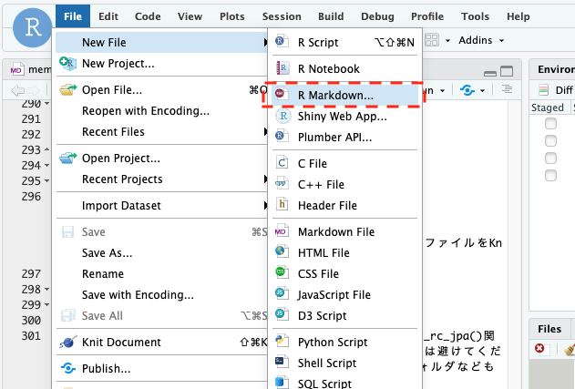
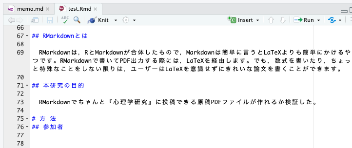

```{r setup, include=FALSE}
options(htmltools.dir.version = FALSE)
```

```{r xaringan-themer, include=FALSE, warning=FALSE}
library(xaringanthemer)
extra_css <- list(
  ".red"   = list(color = "red"),
  ".green"   = list(color = "green"),
  ".small" = list("font-size" = "60%"),
  ".med" = list("font-size" = "80%"),
  ".large" = list("font-size" = "140%"),
  ".full-width" = list(
    display = "flex",
    width   = "100%",
    flex    = "1 1 auto"
  )
)
style_mono_accent(base_color = "#006400",
  text_font_size = "30px",
  code_font_size = "20px",
  padding = "1em 1em 1em 1em",#margin
  header_h1_font_size = "45px",
  header_h2_font_size = "40px",
  header_h3_font_size = "35px",
  header_color = "#006400",
  header_font_google = google_font("Song Myung"),
  text_font_google   = google_font("Song Myung", "400", "400i"),
  code_font_google   = google_font("Song Myung"),
  link_color = "#A52A2A",
  extra_css = extra_css
)
```


# 今日からできる再現可能な論文執筆

1. 再現可能な解析や論文執筆とは？（15分)
1. RStudioとRmarkdown環境を整える（15分)
1. Rmarkdownで英語論文を書いてみよう！(30分)
1. .red[Rmarkdownで日本語論文を書いてみよう！(30分)]
1. スライドも本もウェブサイトも作れるぞ!(15分)
1. 質疑

---
# jpaRmdパッケージ

- rstudioのrticlesは便利だが，日本の心理学系の雑誌には対応していない。

- jpaRmd(https://github.com/ykunisato/jpaRmd )パッケージを自作！（ないなら作る！）

- jpaRmdは，「心理学研究」の投稿時に求められる書式をPDFで出力するRMarkdownのテンプレートを提供するRパッケージ

---
class: center

# 学科長公認変態的Rパッケージ


---
class: center

# 学科長公認変態的Rパッケージ


---
# [脱線]専修大学心理学科卒論用Rmd

- senshuRmd(https://github.com/ykunisato/senshuRmd )は，専修大学の心理学科の卒論で求められる形式のPDF出力するRMarkdownテンプレート用Rパッケージ

- ゼミのRstudioサーバーにゼミ生のアカウントをつくって，ゼミ生はこのRmdを更新＆Githubでバージョン管理（出力されたPDFを確認したり，実際にゼミ中に操作する）

- 作成から１年経つが利用しているのは，弊研究室のみ...
---
# [脱線]事前登録用Rmdテンプレート

- 卒論でも仮説・方法・解析の事前登録できると良い
- [AsPredictedテンプレート用Rmdファイル](https://github.com/ykunisato/AsPredicted_Rmd_template)をゼミ生用に自作
- AsPredicted形式のファイルをGitHubでタイムスタンプ付きで保存すれば簡易の事前登録として使える(もちろんOSFにアップするのも良い)


---
# jpaRmdのインストール

- jpaRmdは，githubからremotesのinstall_github()関数を用いてインストールする(cranには登録されていない)。

```{r eval=FALSE}
# install.packages("remotes")
remotes::install_github("ykunisato/jpaRmd")
```

---
# jpaRmdの使用法


File →

New File →

RMarkdown…

---


From Template →

Japanese Psychological Association format{jpaRmd}をクリックして，OK

Nameを好きな名前にする。

---
# 初knit

フォルダが作成されいくつかのファイルとが配置される。

Rmdファイルが自動に開くので，knitをしてみる。
---

- こんな感じのPDFが出てきたら成功。

- 最初はtexのパッケージのインストールがあるので，数分かかる。

---
# 日本語のためにスペルチェックをオフ

最近のRStudioのスペルチェック機能は日本語入力時には不便（英語は便利）

Tools → Global Options...

赤点線で囲われたチェックボックスのチェックを.red[取る]
---

# 日本語入力のための工夫


RStudioのversion 1.3.1093では，１つ目に開いたファイルでは日本語入力ができない呪いがある(理由は不明)

良い解決法はないので，日本語を入力するファイルの前になにか適当なファイルを開いておいて（例の場合はmemo.md），日本語入力する。
---
# jpaRmdでResearch Compendium

- set_rc_jpa()関数を使えば，『心理学研究』用のRmdや解析，データを配置するフォルダなども準備される。

- set_rc_jpa()の引数にプロジェクト名を入れて実行（これがディレクトリ名になる）

```{r eval=FALSE}
library(jpaRmd)
set_rc_jpa("rmarkdown_for_reproducibility")
```


---

# jpaRmdのResearch Compendium

set_rc_jpa("プロジェクト名")を実行すると，プロジェクト名のディレクトリー下に以下のディレクトリーが作られる。

- analysis: 分析用ファイルを置く場所
- data：データを置く場所
- function：　分析で使う汎用関数のファイルを置く場所
- materials：　研究で使ったマテリアルを置く場所
- paper：　論文原稿を置く場所
- README.md : 説明を書くファイル
---
class: left, middle
# jpaRmdで自分の論文を書いてみよう！
---


title, subtitle, Abstract, Key wordsを自分用に変更する。

原稿には著者名・所属は不要だが，投稿時には必要
---


- 最初に使用するRパッケージをlibrary()関数で読み込む。

- その下から本文を書き始める。

---

- PaperpileやCiNii(日本語文献情報)を利用
---


ちょっと不満もあるが，いい感じで引用できる。
---


『心理学研究』は，25字*32行で1頁800字（余白は3.5cm以上）。その確認用文章。
---

25字*32行の800字で１ページが構成されることを確認（ご自身の環境においても再現できるか確認ください。Dockerなので再現できるはずですが・・・）
---


"#"は，方法，結果，考察などの大見出し

"##"は，参加者や研究手続きなどの中見出し

"**"で挟むと太字になるので，それで小見出しを表現できる

---


- R Markdownの大見出し，中見出しに対応して，PDFが出力される（この調整は地味に大変だった）。
---


論文内で数値の手による打ち込みとコピペをしない

学生の論文や査読でも，数字が合わないような状況はよくある

.red[r sprintf('%.0f',本文にいれる数値のオブジェクト)]で，Rでデータをひっぱてきて本文に挿入する
---


こんな感じで，数値が挿入される。

データが変わると，それに合わせて，本文も書き換わる。
---


- 結果も数値もタイピングとコピペをしない。
- FigureやTableの挿入位置を指定したい場合，.red[”\marginpar{\fbox{Table1}}”]を使う。
---


こんな感じで余白に挿入位置の指定がはいる（色々と試して，これが一番『心理学研究』に近かった）。
---


- 引用文献をいれたいところで，divで囲われた呪文を追加
- 脚注は自動ではないので（自動にすると本文のそのページに脚注が入っちゃう），引用文献の後ろに書き込む。
---

- Rで表のデータを作って，kable()でlatex形式の表を出力
---


- いい感じですね。
- LaTeX形式の表を出力すると，自動でTable1から連番が振られます。

---
- 画像ファイルの挿入は以下のようにする。[]内に図のタイトルを書く。

```

```

.med[※今回はRmdと同じ位置にあるfig1.pngを挿入しているが，場所を指定すれば他のフォルダのファイルも挿入可能(例えば，../analysis/result1.pngも可能)]

- PDFでは以下のように出力される。Table同様，図はFigure1のように連番がつく。


---

# Rのggplotを挿入する

- R Markdownのチャンクを.red[{r figs, echo=FALSE, message=FALSE, warning=FALSE, fig.width=7,fig.height=4,fig.cap="\\label{fig:figs}Examples of bar plot and scatter plot "}]のようにする（fig.width, fig.height, fig.capは適宜変更）。

```{r eval=FALSE}
# 相関係数の算出で使ったと同じデータを使う
summary_bfi_fig2 <- summary_bfi_fig %>% 
   mutate(gender = ifelse(gender=="1", 
   "Male","Female"))
p1 <- ggplot(summary_bfi_fig2,　#以降省略
```


---
# ggplotをAPA風にする

- jtoolsパッケージのtheme_apa()を使うとAPA形式の図を出力できる。p1の方の棒グラフは，長いので省略しますが，以下のようにtheme_apa()を追加すると，論文風の棒グラフになる。

```{r eval=FALSE}
p2 <- ggplot(summary_bfi_fig2,aes(x = Extraversion, y = Neuroticism)) +
   geom_point() +
   theme_apa()
```
---


- 論文っぽい図が描けた。ggplotが使えるのでさらに魅力的な可視化も可能。
---
# 本文はともかく図表の挿入が面倒・・・

- 論文内の数値のミスは，致命的。

- コピペ汚染をできるだけ避けるために，図表の数値をRで直接操作し，それを論文に挿入できるのが理想。

---
# 未解決の問題

- 引用文献はインデントできてない。日本語文献は適切な順番で並んでいない。
- APAフォーマットと微妙に違うので（特に日本語），機械的な調整が難しい

→面倒だがPDF出力してからTeXファイルをいじって，以下を実行することで一応解決できる。しかし，美しくない・・・

```{r eval=FALSE}
xelatex("TeXファイル名.tex")
```
---

# 引用文献問題解決にむけて

- 日本心理学会の日本語文献形式をAPAにより近づけて，機械が出力しやすいフォーマットにしていく？
- 『心理学研究』などの日本の雑誌に特化した引用文献処理関数を作成する？

→TeXやPandocに詳しい方は，jpaRmdの開発にご協力を！


---
## R Markdownをさらに極めたい方へ
.med[
- ドキュメント・プレゼンテーション生成(高橋康介著,2014年，共立出版)
- 再現可能性のすゝめ(高橋康介著,2018年，共立出版)
- 自然科学研究のためのR入門(江口哲史著,2018年，共立出版)
- RユーザのためのRStudio[実践]入門(松村優哉・湯谷啓明・紀ノ定保礼・前田和寛著，2018年,技術評論社)
- R Markdown Cookbook (Yihui Xie, Christophe Dervieux, Emily Riederer, 2020年10月30日, Chapman and Hall/CRC)
]

---

#　jpaRmdついての質問タイム

- jpaRmdはちゃんと動作していますか？

- 『心理学研究』への投稿において足りてない点はないでしょうか？

---
# 引用文献
.small[
- Baker, M. (2016). 1,500 scientists lift the lid on reproducibility. Nature, 533(7604), 452–454.
- Goodman, S. N., Fanelli, D., & Ioannidis, J. P. A. (2016). What does research reproducibility mean? Science Translational Medicine, 8(341), 341ps12.
- Hardwicke, T. E., Mathur, M. B., MacDonald, K., Nilsonne, G., Banks, G. C., Kidwell, M. C., Hofelich Mohr, A., Clayton, E., Yoon, E. J., Henry Tessler, M., Lenne, R. L., Altman, S., Long, B., & Frank, M. C. (2018). Data availability, reusability, and analytic reproducibility: evaluating the impact of a mandatory open data policy at the journal Cognition. Royal Society Open Science, 5(8), 180448.
- Iqbal, S. A., Wallach, J. D., Khoury, M. J., Schully, S. D., & Ioannidis, J. P. A. (2016). Reproducible Research Practices and Transparency across the Biomedical Literature. PLoS Biology, 14(1), e1002333.
- Ioannidis, J. P. A. (2005). Contradicted and initially stronger effects in highly cited clinical research. JAMA: The Journal of the American Medical Association, 294(2), 218–228.
- Open Science Collaboration. (2015). Estimating the reproducibility of psychological science. Science, 349(6251), aac4716.
- Stodden, V., Seiler, J., & Ma, Z. (2018). An empirical analysis of journal policy effectiveness for computational reproducibility. Proceedings of the National Academy of Sciences of the United States of America, 115(11), 2584–2589.
- Wallach, J. D., Boyack, K. W., & Ioannidis, J. P. A. (2018). Reproducible research practices, transparency, and open access data in the biomedical literature, 2015-2017. PLoS Biology, 16(11), e2006930.
]
 