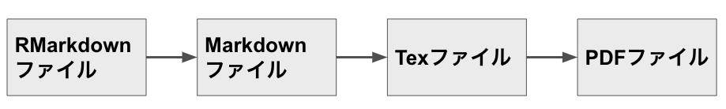

<!-- 
投稿原稿には含めないですが，投稿にあたって以下の情報が必要です。
・著者名（日本語とローマ字）
・所属（日本語とローマ字）
・脚注（研究費や研究に関わった方への謝辞，学会などでの発表，責任著者の英語の連絡先）

<<< このRmdテンプレートを使う際の注意事項 >>>
1.以下に色々と説明が書いてあるので，それにしたがって，書き足していってください。
　作業が進んだら，上の「Knit」を押すと，Rmd→TeX→PDFの変換が自動的になされます。
2.この<!　 >で囲われた部分は，TeXやPDFには反映されないので，削除しなくても大丈夫です。
　削除しても問題はないので，邪魔になったら削除してもいいです。
-->

# Abstract
Can we write a paper of the Japanses Journal of psychology with RMarkdown? To solve this mystery we headed deep into the Amazon. At the end of our long journey we found some great documents about RMarkdown and finally said, "Yes, we can". ... Well, we'll write a abstract like this.

**Key words**: RMarkdown, Reproducibility, The Japanese Journal of Psychology

<!--　このRmdファイル内で使用するRパッケージを以下に追加してください-->

\clearpage

　はじめに，ここから文章を書き始めます。以降が論文の本文になります。どんどん書いていきましょう！

## 心理学における再現可能性

　心理学の再現可能性はとってもまずい状況なのですが，それはちょっとおいておいて，文献の引用の仕方を説明します。まず，@Kunisato2012 のように，すると，bibファイル内のKunisatoの2012年の論文が引用されます。そして，次のように，[]でくくると文末の引用スタイルになります[@kunisato2019]。また，文末に複数引用する場合は，こういう感じにします[@kunisato2019; @Machino2014]。以下に詳しく書いているのでご確認ください。
　
<!-- 
<<< 文献の引用について >>>
bibファイルが用意されていれば，参照名（ラベル）を使って，以下のように簡単に引用できます。
引用は，参照名（ラベル）をコピペしてもいいですが，Addinsにcitrをいれていれば，
"Insert citations"をクリックすると，より簡単に参照名が挿入できます。
また，bibファイルで引用しておくと，このRmdの後ろの方の引用文献セクションにAPA形式になった
引用文献がリスト化されます。

bibファイルの準備に関しては，以下を参照ください。
特に日本語文献は少しややこしい手続きをふむ必要があります。
https://kunisatolab.github.io/main/how-to-write-with-rstudio.html
-->

　続いて，論文では脚注をつけることがあります。その場合は，このように上付き文字をつけます${}^1$。心理学研究では，引用文献の後ろに脚注をつけることになっているので，ここでつけた上付き文字に対応したものを書き込んでおきます。まあ，こんなに短い距離で２つも脚注とかつけないわけですが，練習のために，もう一つつけます${}^2$。

<!-- 以下は1頁が25字*32行で800字になっているかのチェック用です。
ご自身の環境でちゃんと1頁が800字になっているか確認をしてから，削除してください。-->
\clearpage
１２３４５６７８９０１２３４５６７８９０１２３４５６７８９０１２３４５６７８９０１２３４５６７８９０１２３４５６７８９０１２３４５６７８９０１２３４５６７８９０１２３４５６７８９０１２３４５６７８９０１２３４５６７８９０１２３４５６７８９０１２３４５６７８９０１２３４５６７８９０１２３４５６７８９０１２３４５６７８９０１２３４５６７８９０１２３４５６７８９０１２３４５６７８９０１２３４５６７８９０１２３４５６７８９０１２３４５６７８９０１２３４５６７８９０１２３４５６７８９０１２３４５６７８９０１２３４５６７８９０１２３４５６７８９０１２３４５６７８９０１２３４５６７８９０１２３４５６７８９０１２３４５６７８９０１２３４５６７８９０１２３４５６７８９０１２３４５６７８９０１２３４５６７８９０１２３４５６７８９０１２３４５６７８９０１２３４５６７８９０１２３４５６７８９０１２３４５６７８９０１２３４５６７８９０１２３４５６７８９０１２３４５６７８９０１２３４５６７８９０１２３４５６７８９０１２３４５６７８９０１２３４５６７８９０１２３４５６７８９０１２３４５６７８９０１２３４５６７８９０１２３４５６７８９０１２３４５６７８９０１２３４５６７８９０１２３４５６７８９０１２３４５６７８９０１２３４５６７８９０１２３４５６７８９０１２３４５６７８９０１２３４５６７８９０１２３４５６７８９０１２３４５６７８９０１２３４５６７８９０１２３４５６７８９０１２３４５６７８９０１２３４５６７８９０１２３４５６７８９０１２３４５６７８９０１２３４５６７８９０１２３４５６７８９０１２３４５６７８９０１２３４５６７８９０１２３４５６７８９０１２３４５６７８９０１２３４５６７８９０１２３４５６７８９０１２３４５６７８９０１２３４５６７８９０１２３４５６７８９０１２３４５６７８９０１２３４５６７８９０<!-- ここまで削除-->

## RMarkdownとは

　RMarkdownは，RとMarkdownが合体したもので，Markdownは簡単に言うとLaTeXよりも簡単にかけるやつです。RMarkdownで書いてPDF出力する際には，LaTeXを経由します。でも，数式を書いたり，ちょっと特殊なことをしない限りは，ユーザーはLaTeXを意識せずにきれいな論文を書くことができます。

## 本研究の目的
　
　RMarkdownでちゃんと『心理学研究』に投稿できる原稿PDFファイルが作れるか検証した。

# 方 法
## 参加者

<!--　論文内の数値は手で打ち込まずにRから引っ張ってきましょう。
例えば，以下では，Psychパッケージのbfiデータの数値をひっぱっています。
まず，rで性別と年齢のデータを用意して，用意したものを2800という感じで，
挿入しています。これで，数値のコピペミスがなくなります-->

　神奈川県内の私立大学生2800名(男性919名，女性1881名)が調査に参加した。参加者の平均年齢 (標準偏差) は，28.78歳(11.13)であった。

<!--　もし，研究脱落者や調査において欠測値がある場合は，何名がデータから脱落し，
結果として何名を分析対象にしたか述べてください  -->

## 使用変数
<!-- ↑この見出しは，内容に合わせて変更ください-->

**心理学再現性確認尺度**　心理学研究の場合，見出しじゃなくて太字にしたい時というがあると思います。左の心理学再現性確認尺度のように，アスタリスク２つではさむとそれができます。

　論文では，図を挿入したりするのですが，その図の挿入箇所の指示を余白ですることが多いです。例えば，Figure 1をこの辺に挿入しようかなというときは，\marginpar{\fbox{Figure 1}}こういう感じでLatexのmarginparパッケージとfboxを活用して，Figure 1を線で囲ったものを作ります。

## 調査手続き

　見出しは適当につけているので，調査手続きにしたり，実験手続きにしたり変更ください。

## 統計解析
　統計解析について必要に応じて記載ください。Rパッケージなどのオープンソースソフトウェアは無料ですが，だからこそ，その公開した方の科学への貢献に感謝し，適切に引用しましょう。

# 結 果

　論文では，表を挿入したりするのですが，その表の挿入箇所の指示を余白ですることが多いです。例えば，Table1をこの辺に挿入しようかなというときは，\marginpar{\fbox{Table1}}こういう感じでLatexのmarginparパッケージとfboxを活用して，Table1を線で囲ったものを作ります。

## 外向性と神経症傾向の関連

　練習で，psychパッケージのbfiを用いて，外向性と神経症傾向を算出してみましょう。外向性と神経症傾向のPearsonの積率相違関係数は，0.038であり(*t*(2615) = 1.968, *p* = 0.049，その95%信頼区間は，0.000から0.077です。
　散布図は，Figure 2に示す\marginpar{\fbox{Figure 2}}。

# 考 察

　本研究では，RMarkdownで『心理学研究論文』がかけるのかを検証した。それ用のテンプレートも用意したので，あとは解析と内容を書くだけで結構いい感じのものができる。ただし，引用文献については，まだ完全とはいえず，共にこのテンプレートを磨く有志を心待ちしている。

\clearpage 

# 引用文献

\clearpage 
# 脚注

<!-- 必要に応じて脚注を追加ください。不要ならclearpageから削除ください-->

${}^1$脚注の例１です。論文の補足をどうぞ。

${}^2$脚注の例2です。

\clearpage 
\newgeometry{left = 3cm, right = 3cm, top = 3cm, bottom = 3cm}
# 表

\begin{table}[!h]

\caption{\label{tab:unnamed-chunk-4}Descriptive Statistics of bfi}
\centering
\begin{tabular}[t]{lrrrrrrrr}
\toprule
  & n & Mean & SD & Median & Min & Max & Skewness & kurtosis\\
\midrule
\cellcolor{gray!6}{Extraversion} & \cellcolor{gray!6}{2713} & \cellcolor{gray!6}{18.96} & \cellcolor{gray!6}{2.71} & \cellcolor{gray!6}{19} & \cellcolor{gray!6}{5} & \cellcolor{gray!6}{29} & \cellcolor{gray!6}{0.01} & \cellcolor{gray!6}{1.08}\\
Neuroticism & 2694 & 15.82 & 5.97 & 15 & 5 & 30 & 0.22 & -0.66\\
\cellcolor{gray!6}{Conscientiousness} & \cellcolor{gray!6}{2707} & \cellcolor{gray!6}{19.04} & \cellcolor{gray!6}{2.77} & \cellcolor{gray!6}{19} & \cellcolor{gray!6}{5} & \cellcolor{gray!6}{30} & \cellcolor{gray!6}{-0.17} & \cellcolor{gray!6}{0.81}\\
Agreeableness & 2709 & 21.04 & 3.68 & 22 & 5 & 30 & -0.66 & 0.68\\
\cellcolor{gray!6}{Openness} & \cellcolor{gray!6}{2726} & \cellcolor{gray!6}{19.34} & \cellcolor{gray!6}{2.74} & \cellcolor{gray!6}{19} & \cellcolor{gray!6}{5} & \cellcolor{gray!6}{29} & \cellcolor{gray!6}{-0.02} & \cellcolor{gray!6}{1.09}\\
\bottomrule
\multicolumn{9}{l}{\textsuperscript{a} Note. SD=standard deviation}\\
\end{tabular}
\end{table}

\clearpage 
# 図

\clearpage 
<!-- Rのggplotで論文の図を作った場合　
Rチャンクの指定において，\\label{fig:figs}以降に図のタイトルを書きます。
-->
 

\clearpage 
# 付録

新たに質問紙を作成したら，どこかで使った質問票を公開してほしい・・・

<!-- 必要に応じて付録を追加ください。不要ならclearpageから削除ください-->
